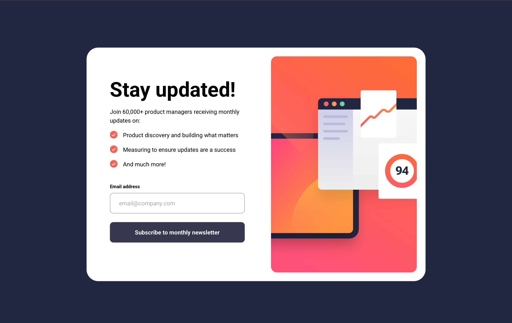
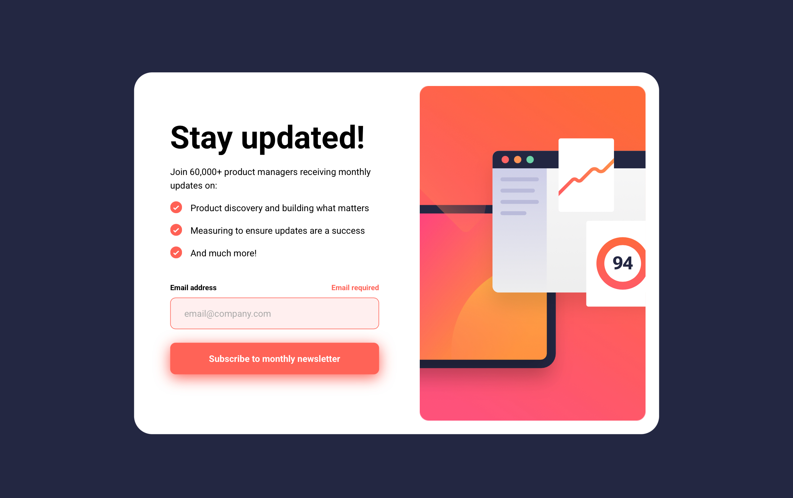
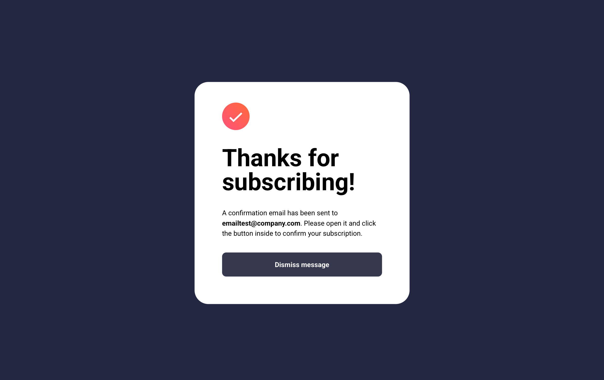
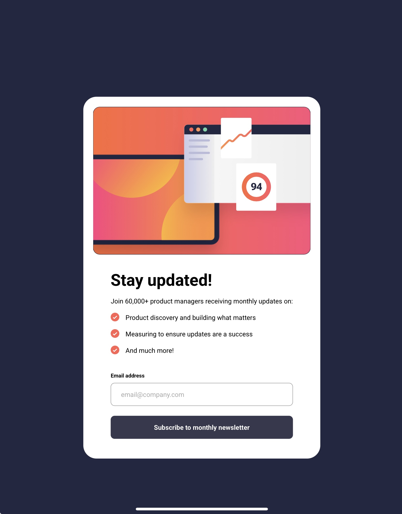
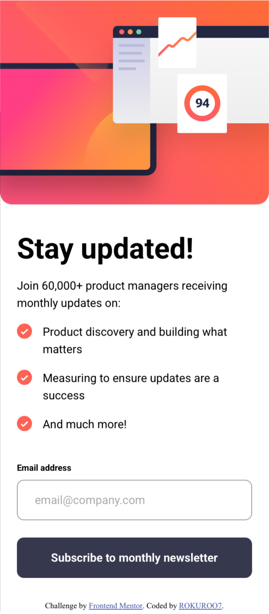
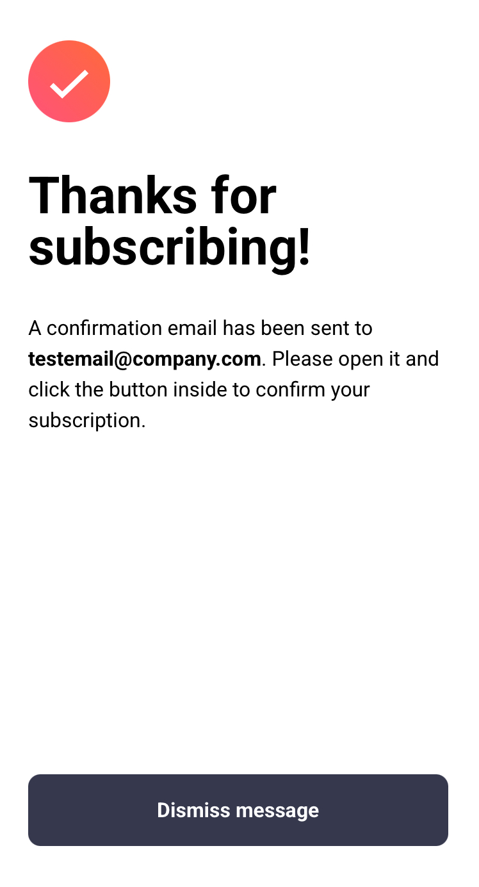

# Frontend Mentor - Newsletter sign-up form with success message solution

This is a solution to the [Newsletter sign-up form with success message challenge on Frontend Mentor](https://www.frontendmentor.io/challenges/newsletter-signup-form-with-success-message-3FC1AZbNrv). Frontend Mentor challenges help you improve your coding skills by building realistic projects. 

## Table of contents

- [Overview](#overview)
  - [The challenge](#the-challenge)
  - [Screenshot](#screenshot)
  - [Links](#links)
- [My process](#my-process)
  - [Built with](#built-with)
  - [What I learned](#what-i-learned)

## Overview

### The challenge

Users should be able to:

- Add their email and submit the form
- See a success message with their email after successfully submitting the form
- See form validation messages if:
  - The field is left empty
  - The email address is not formatted correctly
- View the optimal layout for the interface depending on their device's screen size
- See hover and focus states for all interactive elements on the page

### Screenshot

- Desktop



- Error screen



- Desktop/Tablet Success 



- Tablet



- Mobile



- Mobile Success



### Links

- Solution URL: [https://github.com/ROKUROO7/Newsletter-sign-up-with-success-message](https://github.com/ROKUROO7/Newsletter-sign-up-with-success-message)
- Live Site URL: [https://rokuroo7.github.io/Newsletter-sign-up-with-success-message/](https://rokuroo7.github.io/Newsletter-sign-up-with-success-message/)

## My process

### Built with

- Semantic HTML5 markup
- BEM
- SASS (scss)
- CSS custom properties
- Flexbox
- CSS Grid
- Mobile-first workflow

### What I learned

In this project i struggled with setting the list marker. I used different approches like using list-style-image, (::before, ::marker) Pseudo elements etc. but nothing looked similar to the design screenshots.

After multiple trials and errors. I Finally found the solution  by setting the "icon-list.svg" as background image and using padding to look like a list marker. While also looking much similar to the design screenshot.

```css
.sign-up_list li {
  background-image: url(../assets/images/icon-list.svg);
  background-repeat: no-repeat;
  padding-block-end: 1rem;
  padding-inline-start: 2.25rem;
  line-height: 1.5;
}
```